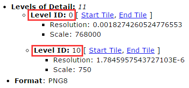
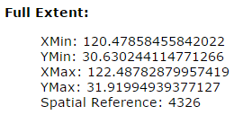
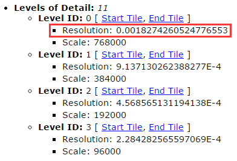
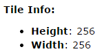
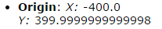
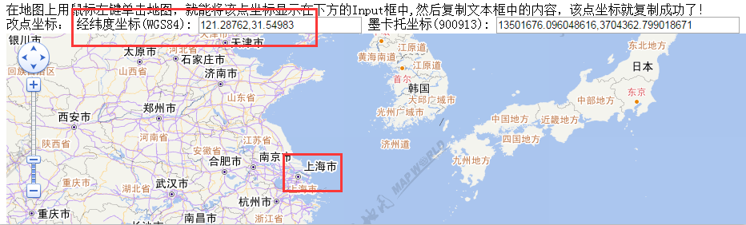
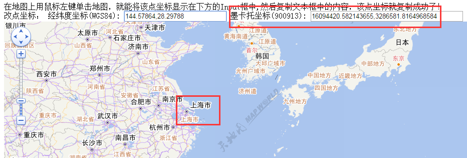
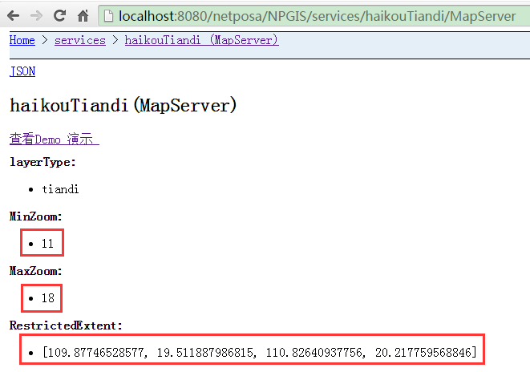

# NPGIS对于各种地图的接入方式总结

## 一、现场提供地图

### 1. 1 提供 `PGIS 4326`

#### 1.1.1 获取相关参数

在 `PGIS` 地图展示页面，按 `F12`，找到 `EzMapAPI.js` 文件，获取相关参数。


##### 1.1.1.1 获取地图服务地址 

* 搜索： `EzServerClient.GlobeParams.MapSrcURL` 

  找到如下内容：

    ```json
    // 包括：矢量地图URL,影像地图URL和矢量影像地图URL,根据需求配置。
    EzServerClient.GlobeParams.MapSrcURL = [
        ["矢量地图", ["http://10.173.2.20/PGIS_S_TileMapServer/Maps/V"]],
        ["影像地图", ["http://10.173.2.20/PGIS_S_TileMapServer/Maps/R"]],
        ["矢量影像地图", ["http://10.173.2.20/PGIS_S_TileMapServer/Maps/RV"]],
    ]
    ```

##### 1.1.1.2 获取地图中心点

* 搜索：`EzServerClient.GlobeParams.CenterPoint`

    ```json
    EzServerClient.GlobeParams.CenterPoint = [
        108.72265, 34.24023
    ]
    ```

##### 1.1.1.3 地图最小/最大层级/偏移量获取

* 最小层级： `EzServerClient.GlobeParams.MapInitLevel`

    ```json
    EzServerClient.GlobeParams.MapInitLevel = 12
    ```

* 最小层级： `EzServerClient.GlobeParams.MapMaxLevel`

    ```json
    EzServerClient.GlobeParams.MapMaxLevel = 20
    ```

* 偏移量：`EzServerClient.GlobeParams.ZoomOffsetragment`

  ```json
  EzServerClient.GlobeParams.ZoomOffset = 0
  ```


##### 1.1.1.4 地图范围获取 

* `EzServerClient.GlobeParams.MapFullExtent`

  ```json
  EzServerClient.GlobeParams.MapFullExtent = [ 107.4414, 33.75, 110.0039, 34.73046 ]
  ```

  

#### 1.1.2 示例代码

```javascript
var mapContainer = document.getElementById("mapId");
var map = new NPMapLib.Map(mapContainer, {
    minZoom: 11,              // 初始值：zoomOffset + 地图最小层级，根据实际情况调整
    maxZoom: 19,              // zoomOffset + 地图最大层级
    projection: "EPSG:4326"   // 投影方式：4326
});

// 图层参数
var opts = {
    centerPoint: [116.99267, 36.66586],                      // 中心点坐标
    fullExtent:  [116.71416, 36.48037, 117.27471, 36.84609], // 地图范围
    minLevel: 11,    // 初始值：zoomOffset + 地图最小层级，根据实际情况调整
    maxLevel: 19,    // zoomOffset + 地图最大层级
    zoomOffset: 0    // 默认0
};

var url = "http://10.48.1.227:9080/PGIS_S_TileMapServer/Maps/default"
layerSLYX = new NPMapLib.Layers.EzMapTileLayer(url, "矢量影像地图", opts);
map.addLayers([layerSLYX]);

// 注意：地图的最小层级根据具体的需要做调整
```


### 1.2. 提供 `ArcGIS 4326`

#### 1.2.1 获取相关参数

从服务地址 http://192.168.60.242:6080/arcgis/rest/services/shanghaiBaseMap/MapServer ，获取相关参数。

##### 1.2.1.1 获取最小/最大层级



##### 1.2.1.2 最大范围



##### 1.2.1.3 分辨率数组



##### 1.2.1.4 切片大小



##### 1.2.1.5 切片原点



##### 1.2.1.6 投影方式


#### 1.2.2 示例代码

```javascript
var mapContainer = document.getElementById(mapId);
var map = new NPMapLib.Map(mapContainer, {
    minZoom: 0,       // 最小缩放级别
    maxZoom: 10,      // 最大缩放级别
    restrictedExtent: [
        120.21702921092, 29.953534077485,
        122.55613455809, 32.292639424656
    ]
});

var extent = [ // 最大范围
    120.47858455842022, 30.630244114771266,
    122.48782879957419, 31.91994939377127
];

var url = 'http://192.168.60.242:6080/arcgis/rest/services/shanghaiBaseMap/MapServer'; // 服务地址
var baseLayer = new NPMapLib.Layers.ArcgisTileLayer(url, 'Aerials', {
    isBaseLayer: true,
    resolutions: [  // 分辨率数组
        0.0018274260524776553, 0.0009137130262388277,
        0.0004568565131194138, 0.0002284282565597069,
        0.00011421412827985346, 0.00005710706413992673,
        0.000028553532069963364, 0.000014276766034981682,
        0.000007138383017490841, 0.0000035691915087454205,
        0.0000017845957543727103
    ],
    tilePixels: 256,                     // 切片大小
    origin: [-400, 399.9999999999998],   // 切片原点
    fullExtent: extent,                  // 最大范围
    projection: 'EPSG:4326',             // 投影方式
    zoomOffset: 0                        // 偏移量，控制从第几级开始显示地图
});
map.addLayers([baseLayer]);
```


## 二、现场不提供地图

### 2.1 天地图

#### 2.1.1 天地图在线地图（需联网）

天地图是经纬度坐标（`4326`），以下以上海市为例

##### 2.1.1.1 使用拾位器获取上海市的中心点

* 使用方法

  


##### 2.1.1.2 代码示例

```javascript
var mapContainer = document.getElementById("mapId");
map = new NPMapLib.Map(mapContainer, {
    minZoom: 10,                         // 最小级别，可根据需要设置
    maxZoom: 18                          // 最大级别
});

//图层参数
var opts1 = {
    mapType: 'EMap',
    centerPoint: [121.28762,31.54983],   // 中心点坐标，使用拾位器获得
    fullExtent: [-180, -90, 180, 90],    // 固定值，不可改动
    topLevel: 0,                         // 固定值，不可改动
    bottomLevel: 18,                     // 固定值，不可改动
    isBaseLayer: true,
    mirrorUrls: [					   // 固定值，不可改动
        "http://tile4.tianditu.com/DataServer", 
        "http://tile5.tianditu.com/DataServer", 
        "http://tile6.tianditu.com/DataServer"
    ],
    zoomOffset: 0                       // 固定值，不可改动
};

var opts2 = {
    mapType: 'ESatellite',
    centerPoint: [121.28762,31.54983],  // 中心点坐标，使用拾位器获得
    fullExtent: [-180, -90, 180, 90],   // 固定值，不需改动
    topLevel: 0,                        // 固定值，不可改动
    bottomLevel: 18,                    // 固定值，不可改动
    isBaseLayer: false,
    mirrorUrls: [					  // 固定值，不可改动
        "http://tile4.tianditu.com/DataServer",
        "http://tile5.tianditu.com/DataServer",
        "http://tile6.tianditu.com/DataServer"
    ],
    zoomOffset: 0                       // 固定值，不可改动
};

var url = "http://tile1.tianditu.com/DataServer";  //  固定值，不可改动
var layerSLYX = new NPMapLib.Layers.TDMapLayer(url, "ditu", opts1);
var layerBZ = new NPMapLib.Layers.TDMapLayer(url, "biaozhu", opts2);
map.addLayers([layerSLYX, layerBZ]);
```


#### 2.2.1 天地图离线地图

天地图是经纬度坐标（`4326`），以下以上海市为例。

##### 2.2.1.1 示例代码

```javascript
var mapContainer = document.getElementById("mapId");
map = new NPMapLib.Map(mapContainer, {
    minZoom: 13,                        // 最小级别，根据实际切片的级数来确定
    maxZoom: 16,                        // 最大级别，根据实际切片的级数来确定
    restrictedExtent: [                 // 抓图工具设置的抓图范围
        116.85704040528, 33.551647186279,
        117.10835266114, 33.725025177002
    ],
    projection: "EPSG:4326" 
});

//图层参数
var opts1 = {
    mapType: 'EMap',
    centerPoint: [116.98269653321, 33.6383361816405], // 抓图工具设置的中心点
    fullExtent: [-180, -90, 180, 90],                 // 固定值，不可改动
    topLevel: 0,                                      // 固定值，不可改动
    bottomLevel: 18,                                  // 固定值，不可改动
    isBaseLayer: true,
    mirrorUrls: ["http://192.168.60.242:1080/Cache/suzhou/vec_c/"], // 切片所在位置
    zoomOffset: 0,
    isLocalMap: true
};
var opts2 = {
    mapType: 'ESatellite',
    centerPoint: [116.98269653321, 33.6383361816405], // 抓图工具设置的中心点
    fullExtent: [-180, -90, 180, 90],                 // 固定值，不可改动
    topLevel: 0,                                      // 固定值，不可改动
    bottomLevel: 18,                                  // 固定值，不可改动
    isBaseLayer: false,
    mirrorUrls: ["http://192.168.60.242:1080/Cache/suzhou/cva_c/"], // 切片所在位置
    zoomOffset: 0,
    isLocalMap: true
};

var url = "http://tile1.tianditu.com/DataServer";     // 固定值，不可改动
var layerSLYX = new NPMapLib.Layers.TDMapLayer(url, "ditu", opts1);
var layerBZ = new NPMapLib.Layers.TDMapLayer(url, "biaozhu", opts2);
map.addLayers([layerSLYX, layerBZ]);
```


### 2.2 高德地图

#### 2.2.1 高德地图在线地图  （需联网）

高德地图是墨卡托坐标（`900913`），比较特殊。以下以上海市为例。

##### 2.2.1.1 使用拾位器获取上海市的中心点



##### 2.2.1.2 代码示例

```javascript
var mapContainer = document.getElementById("mapId");
map = new NPMapLib.Map(mapContainer, {
    minZoom: 5,
    maxZoom: 18,
    projection: "EPSG:900913",         // 固定值，不可改动
    displayProjection: "EPSG:4326"     // 固定值，不可改动
});

//图层参数
var opts = {
    centerPoint: [16094420.582143655,3286581.8164968584], // 中心点坐标，使用拾位器获得
    fullExtent: [                                         // 固定值，不可改动
        -20037508.3427892, -20037508.3427892, 20037508.3427892, 20037508.3427892
    ],
    isBaseLayer: true
};

var url = [                                              // 固定值，不可改动
	"http://webrd01.is.autonavi.com/appmaptile??lang=zh_cn&size=1&scale=1&style=7",
    "http://webrd02.is.autonavi.com/appmaptile??lang=zh_cn&size=1&scale=1&style=7",
    "http://webrd03.is.autonavi.com/appmaptile??lang=zh_cn&size=1&scale=1&style=7",
    "http://webrd04.is.autonavi.com/appmaptile??lang=zh_cn&size=1&scale=1&style=7"
];
var layerSLYX = new NPMapLib.Layers.GaoDeLayer(url, "ditu", opts);
map.addLayers([layerSLYX]);
```

#### 2.2.2 高德地图离线地图

##### 2.2.2.1 示例代码 

```javascript
var mapContainer = document.getElementById("mapId");
var map = new NPMapLib.Map(mapContainer, {
    minZoom: 10,                    // 最小级别，可根据需要设置
    maxZoom: 17,                    // 最大级别
    projection: "EPSG:900913",      // 固定值，不可改动
    restrictedExtent: [             // 抓图工具设置的抓图范围
        11756895.710823, 3374126.8928473,
        11958383.717383, 3505904.3296109
    ]
});

var url = 'http://192.168.60.242:1080/cache/chongqing_gaode/';    // 切片所在位置
var baseLayer = new NPMapLib.Layers.GaoDeLayer(url, 'Aerials', {
    isBaseLayer: true,
    tilePixels: 256,                     // 固定值，不可改动
    isLocalMap: true, 
    centerPoint: [11856895, 3405904],    // 抓图工具设置的中心点
    zoomOffset: 0                        // 固定值，不可改动
});

map.addLayers([baseLayer]);
```


## 三、PVA 接入方法

> 地图配置文件： `module/common/js/npmap-config.js`

### 3.1 总配置

* `serviceType`：地图类型，现支持 `arcgis`、`pgis`、`mapworld`、`googlemap`、`gaodemap`
* `Baselayer`：服务URL


### 3.2 NPGIS Server天地图地图服务配置

以服务地址为: http://localhost:8080/netposa/NPGIS/services/haikouTiandi/MapServer 的海口天地地图配置说明PVA 配置方法：

####3.2.1 Baselayer

* 首先，要通过GIS组提供的地图下载工具 下载天地图切片，然后按照`NPGIS Server`部署文档部署`NPGIS Server`天地图服务。

  http://localhost:8080/netposa/NPGIS/services/haikouTiandi/MapServer

* `Baselayer`的值为：NPGIS Server天地图地图服务地址+`/getTile?`

```javascript
mapConfig = {
    // 接入服务
    serviceType: "mapworld",  // 接入服务类型 arcgis/pgis/mapworld/googlemap
    // 基础图层
    baselayer: "http://localhost:8080/netposa/NPGIS/services/haikouTiandi/MapServer/getTile?"
}
```

#### 3.2.1 Map参数配置

```javascript
// 天地图 地图范围配置
mapworldMapOpts:{
    minZoom: 11,
    maxZoom: 18,
        restrictedExtent: [
            109.87746528577, 19.511887986815,
            110.82640937756, 20.217759568846
        ]
}
```

`minZoom`、`maxZoom`、`restrictedExtent`三个参数分别从：http://localhost:8080/netposa/NPGIS/services/haikouTiandi/MapServer 页面读取



#### 3.2.2 Layer参数配置

```json
mapworldLayerOpts: [
    {
        mapType: '',
        centerPoint: [ 110.351937331665, 19.8648237778305 ],
        topLevel: 0,
        bottomLevel: 18,
        isBaseLayer: true,
        zoomOffset: 0
    }
]
```

#### 3.2.3 地图初始化方法修改

```javascript
// 初始化图层
initLayer: function(layerurl, layername){
    var layer = [];
    if(this.serviceType === 'arcgis'){
        // 创建图层
        layer = [new NPMapLib.Layers.ArcgisTileLayer(layerurl, layername, this.layerOpts)];
    }else if (this.serviceType === 'pgis'){
        layer = [new NPMapLib.Layers.EzMapTileLayer(layerurl, layername, this.pgisLayerOpts)];
    }else if(this.serviceType === 'mapworld'){
        var layer1 = [new NPMapLib.Layers.TDMapTileLayer(layerurl, layername, this.mapworldLayerOpts[0])];
        layer = [layer1];
    }else{
        layer = [new NPMapLib.Layers.GoogleOffLineLayer(layerurl, layername, this.googlemapLayerOpts)];
    }
    return layer;
}
```


### 3.3 Arcgis 服务配置

```json
mapZoomAndExtentOpts:{
		minZoom: 0,           // 地图允许展示的最小级别 
		maxZoom: 10,          // 地图允许展示的最大级别 
		restrictedExtent:[
            120.21702921092,  29.485713008051,
            123.02395562752,  32.292639424656
        ]
	},
	//arcgis 地图图层配置
	layerOpts: {
		isBaseLayer: true,
		resolutions: [
			0.0018274260524776553, 0.0009137130262388277,
			0.0004568565131194138, 0.0002284282565597069,
			0.00011421412827985346, 0.00005710706413992673,
			0.000028553532069963364, 0.000014276766034981682,
			0.000007138383017490841, 0.0000035691915087454205,
			0.0000017845957543727103
		],
		tilePixels: 512,                     // 切片大小
		origin: [-400, 400],                 // 切片起始点
		projection: 'EPSG:4326',      		// 投影方式
		centerPoint: [112.53929,37.84696],   // 中心点
		zoomOffset: 0                        // 偏移量，控制从第几级开始显示地图
	},
```


### 3.4 PGIS 配置

```json
//pgis 地图范围和级别范围设置
pgisMapOpts: {
    minZoom: 11,                              // 最小图层级别
    maxZoom: 19,                              // 最大图层级别
    maxResolution:2,                          // 最大分辨率,
    projection: "EPSG:3785",                  // 投影方式
    originCenter: [111.677695, 40.836575],    // 中心点
    resolution: 0.0009765625,                 // 初始分辨率
    fullExtent: [ 110.65879, 38.82641, 112.6966, 40.84674 ],
    maxExtent: [ 110.65879, 38.82641, 112.6966, 40.84674 ]
},
//pgis 地图图层配置
pgisLayerOpts: {
    type: "png",                             // 图片格式
    maxZoomLevel: 19,                        // 最大图层级别
    resolutions: [2,1,0.5,0.25,0.125,0.0625,0.03125,0.015625,0.0078125,0.00390625,0.001953125,0.0009765625,0.00048828125,0.000244140625,0.0001220703125,0.00006103515625,0.000030517578125,0.0000152587890625,0.00000762939453125,0.000003814697265625,0.0000019073486328125,9.5367431640625e-7,4.76837158203125e-7],
    maxResolution: 2,
    units: "Lat-66",                        // 单位
    tileOrigin: [0, 0]                      // 切片起始点
}
```


### 3.5 天地在线地图

```json
//天地图 地图范围配置
mapworldMapOpts: {
    minZoom: 10,
    maxZoom: 17
},
//天地图 地图图层配置
mapworldLayerOpts: [{
    mapType:'EMap',
    centerPoint: [121.46256,31.23398],
    topLevel: 0,
    bottomLevel: 18,
    isBaseLayer: true,
    mirrorUrls:[
        "http://tile0.tianditu.com/DataServer",
        "http://tile1.tianditu.com/DataServer",
        "http://tile2.tianditu.com/DataServer",
        "http://tile3.tianditu.com/DataServer",
        "http://tile4.tianditu.com/DataServer",
        "http://tile5.tianditu.com/DataServer",
        "http://tile6.tianditu.com/DataServer"
    ],
    zoomOffset: 0
},{
    mapType:'ESatellite',
    centerPoint: [121.46256,31.23398],
    topLevel: 0,
    bottomLevel: 18,
    isBaseLayer: false,
    mirrorUrls:[
        "http://tile0.tianditu.com/DataServer",
        "http://tile1.tianditu.com/DataServer",
        "http://tile2.tianditu.com/DataServer",
        "http://tile3.tianditu.com/DataServer",
        "http://tile4.tianditu.com/DataServer",
        "http://tile5.tianditu.com/DataServer",
        "http://tile6.tianditu.com/DataServer"
    ],
    zoomOffset: 0
}],
```


### 3.6 天地地图离线地图

```json
mapworldMapOpts: {
    minZoom: 10,
    maxZoom: 17
},
//天地图 地图图层配置
mapworldLayerOpts: [{
    mapType:'EMap',
    centerPoint: [121.46256,31.23398],
    topLevel: 0,
    bottomLevel: 18,
    isBaseLayer: true,
    mirrorUrls:["/map/vec_c/"],
    zoomOffset: 0
},{
    mapType:'ESatellite',
    centerPoint: [121.46256,31.23398],
    topLevel: 0,
    bottomLevel: 18,
    isBaseLayer: false,
    mirrorUrls:["/map/cva_c/"],
    zoomOffset: 0,
    isLocalMap: true
}],
```


### 3.7 高德在线地图

### 3.8 高德离线地图

### 3.9 和业务相关的地图配置

#### 3.9.1 地图标注默认 Zoom

```json
settings:{
    // 地图标注默认放大级别(value需要根据实际情况配置)
    markZoom:4
},
```

#### 3.9.2 全景小地图默认打开图层

```json
fullviewZoom: 6
```

#### 3.9.3 双击摄像机定位地图级别

```json
dbclcikCameraMapZoom: 6
```

#### 3.9.4 **视野**范围内搜索

```json
viewSearchZoom: 6
```

#### 3.9.5 聚合颜色 提供两种颜色"red"、"blue"

```json
clusterColor: "red"
```

#### 3.9.6 框选限制

```json
selectZoom: 6
```


## 四、PVD接入方法

地图配置文件地址: `assets/scripts/vim/map/mapConfig.js`

####　　4.1 Arcgis 配置

```javascript
module.exports = {
    /**********聚合点默认图片路径**********/
    'customNormal': '/assets/images/map/custom_Normal.png',
    'cluster1': '/assets/images/map/map-cluster-1.png',
    'cluster2': '/assets/images/map/map-cluster-2.png',
    'cluster3': '/assets/images/map/map-cluster-3.png',
    'cluster4': '/assets/images/map/map-cluster-4.png',
    /**********地图类型**********/
    'layerType': 'ArcgisTileLayer',
    /**********底图服务地址**********/
    // 'url': '/map/ArcgisTileLayer',
    'url': 'http://192.168.60.242:6080/arcgis/rest/services/shanghaiBaseMap/MapServer',
    /**********地图允许展示的最大缩放级别**********/
    'minLevel': 0,
    /**********地图允许展示的最小缩放级别**********/
    'maxLevel': 10,
    /**********地图中心点**********/
    'CenterPoint': '121.4832066789972, 31.27509675427127',
    /**********分辨率数组**********/
    'resolutions': '0.0018274260524776553, 0.0009137130262388277,0.0004568565131194138, 0.0002284282565597069,0.00011421412827985346, 0.00005710706413992673,0.000028553532069963364, 0.000014276766034981682,0.000007138383017490841, 0.0000035691915087454205,0.0000017845957543727103',
    /**********地图显示的限制范围(需要限制范围时再定义)**********/
    'restrictedExtent': [
        13423402.728774, 3562204.3833067,
        13657893.035257, 3796407.4379399
    ],
    /**********切片大小**********/
    'tilePixels': 256,
    /**********切片类型**********/
    'Tiletype': 'png',
    /**********切片原点**********/
    'origin': '-400, 399.9999999999998',
    /**********单位（米）**********/
    'Units': 'm',
    /**********地图层级偏移量**********/
    'zoomOffset': 0,
    /**********地图区域范围**********/
    'extent': '119.47858455842022, 29.630244114771266, 123.48782879957419, 32.91994939377127',
    /**********显示的坐标系**********/
    'DisplayProjection': 'EPSG:4326',
    /**********地图真实的坐标系**********/
    'projection': 'EPSG:4326',
    /**********聚合点配置**********/
    'conflux': {
        /**********是否显示聚合点**********/
        'enble': true,
        /**********撒点层级**********/
        'maxZoom': 6,
        /**********点击聚合点的跳转层级**********/
        // 'selectZoom': 6,
        /**********聚合距离（像素）**********/
        'distance': 80
    }
};
```

#### 4.2 PGIS 配置

```javascript
module.exports = {
    'customNormal': '/assets/images/map/custom_Normal.png',
    'cluster1': '/assets/images/map/map-cluster-1.png',
    'cluster2': '/assets/images/map/map-cluster-2.png',
    'cluster3': '/assets/images/map/map-cluster-3.png',
    'cluster4': '/assets/images/map/map-cluster-4.png',
    'DisplayProjection': 'EPSG:900913',
    'projection': 'EPSG:3785',
    'layerType': 'PGIS', 
    'maxLevel': 20,
    'minLevel': 12,
    'url': '',
    'CenterPoint': '112.53929,37.84696',
    'extent': '110.4375,34.51562,114.25,40.5625',
    'MaxResolution': 2,
    'resolutions': '2,1,0.5,0.25,0.125,0.0625,0.03125,0.015625,0.0078125,0.00390625,0.001953125,0.0009765625,0.00048828125,0.000244140625,0.0001220703125,0.00006103515625,0.000030517578125,0.0000152587890625,0.00000762939453125,0.000003814697265625,0.0000019073486328125,9.5367431640625e-7,4.76837158203125e-7',
    'NumZoomLevels': 20,
    'tilePixels': 256,
    'Tiletype': 'png',
    'origin': '0,0',
    'Units': 'Lat-66',
    'ZoomLevelSequence': 2,
    'zoomOffset': 0
};
```


#### 4.3 离线天地地图

```javascript
module.exports = {
    'customNormal': '/assets/images/map/custom_Normal.png',
    'cluster1': '/assets/images/map/map-cluster-red-1.png',
    'cluster2': '/assets/images/map/map-cluster-red-2.png',
    'cluster3': '/assets/images/map/map-cluster-red-3.png',
    'cluster4': '/assets/images/map/map-cluster-red-4.png',
    'conflux': {
        'enble': true,
        'maxZoom': 14,
        'selectZoom': 14,
        'distance': 120
    },
    minLevel: 10,
    maxLevel: 16,
    'layerType': 'TiandiMap',
    'labelYOffset': 2,
    'IElabelYOffset': -2,
    "restrictedExtent":[116.58693388281, 38.543688869141, 118.08656767188, 40.287768458984],
    'tiandiMapopts1': {
        mapType: 'EMap',
        centerPoint: [117.336750777345,39.4157286640625],
        fullExtent: [-180, -90, 180, 90],
        topLevel: 0,
        bottomLevel: 18,
        isBaseLayer: true,
        isLocalMap: true,
        url: '/vec_c/',
        zoomOffset: 0
    },
    'tiandiMapopts2': {
        mapType: 'ESatellite',
        centerPoint: [117.336750777345,39.4157286640625],
        fullExtent: [-180, -90, 180, 90],
        topLevel: 0,
        bottomLevel: 18,
        isLocalMap: true,
        isBaseLayer: false,
        url: '/cva_c/',
        zoomOffset: 0
    },
    CenterPoint: '117.336750777345,39.4157286640625'
};
```


#### 4.4 在线天地地图配置

```javascript
module.exports = {
    'customNormal': '/assets/images/map/custom_Normal.png',
    'cluster1': '/assets/images/map/map-cluster-red-1.png',
    'cluster2': '/assets/images/map/map-cluster-red-2.png',
    'cluster3': '/assets/images/map/map-cluster-red-3.png',
    'cluster4': '/assets/images/map/map-cluster-red-4.png',
    'conflux': {
        'enble': true,
        'maxZoom': 14,
        'selectZoom': 14,
        'distance': 120
    },
    minLevel: 10,
    maxLevel: 16,
    'layerType': 'TiandiMap',
    'labelYOffset': 2,
    'IElabelYOffset': -2,
    "restrictedExtent":[
        116.58693388281, 38.543688869141,
        118.08656767188, 40.287768458984
    ],
    'tiandiMapopts1': {
        mapType: 'EMap',
        centerPoint: [117.336750777345,39.4157286640625],
        fullExtent: [-180, -90, 180, 90],
        topLevel: 0,
        bottomLevel: 18,
        isBaseLayer: true,   
        isBaseLayer: false,
        mirrorUrls: [
            'http://tile0.tianditu.com/DataServer',
            'http://tile1.tianditu.com/DataServer',
            'http://tile2.tianditu.com/DataServer',
            'http://tile3.tianditu.com/DataServer',
            'http://tile4.tianditu.com/DataServer',
            'http://tile5.tianditu.com/DataServer',
            'http://tile6.tianditu.com/DataServer'
        ],
        zoomOffset: 0
    },
    'tiandiMapopts2': {
        mapType: 'ESatellite',
        centerPoint: [117.336750777345,39.4157286640625],
        fullExtent: [-180, -90, 180, 90],
        topLevel: 0,
        bottomLevel: 18,
        isLocalMap: false,
        isBaseLayer: false,
        mirrorUrls: [
            'http://tile0.tianditu.com/DataServer',
            'http://tile1.tianditu.com/DataServer',
            'http://tile2.tianditu.com/DataServer',
            'http://tile3.tianditu.com/DataServer',
            'http://tile4.tianditu.com/DataServer',
            'http://tile5.tianditu.com/DataServer',
            'http://tile6.tianditu.com/DataServer'
        ],
        zoomOffset: 0
    },
    CenterPoint: '117.336750777345,39.4157286640625'
};
```


## 五、地图配置过程中出现的问题总结

### 5.1 PGIS 地图在内网部署，PVA /PVD 在专网部署

#### 5.1.1 解决方法：

* PGIS 地图通过授权PVD 所在的机器可以访问内网PGIS 地图。
* PVD nginx 通过代理配置使专网可以访问PGIS 地图。
* PVA nginx 中代理配置地图访问PVD 的地图地址。


#### 5.1.2 详细配置如下：

* Pva : pva.conf 新增配置如下

  ```nginx
  location ^~ /pgisservice/ {
  
      proxy_pass http://PVD_Service/pgisservice;   # PVD 地图地址
      proxy_cookie_path  /pva/ /; 
      proxy_redirect      default;
      proxy_set_header    Host    host:server_port;
      proxy_set_header    X-Real-IP $remote_addr;
      proxy_set_header    X-Forwarded-Host host:server_port;
      proxy_set_header    X-Forwarded-Server host:server_port;
      proxy_set_header    X-Forwarded-For  $proxy_add_x_forwarded_for;            
  }
  ```

* Pvd: nginx.conf 配置

  ```nginx
   location ^~ /pgisservice/ {
  
      proxy_pass http://PGIS_Service/;   # PGIS地图地址
      proxy_cookie_path  /pva/ /; 
      proxy_redirect      default;
      proxy_set_header    Host    host:server_port;
      proxy_set_header    X-Real-IP $remote_addr;
      proxy_set_header    X-Forwarded-Host host:server_port;
      proxy_set_header    X-Forwarded-Server host:server_port;
      proxy_set_header    X-Forwarded-For  $proxy_add_x_forwarded_for;            
  }
  ```

  
